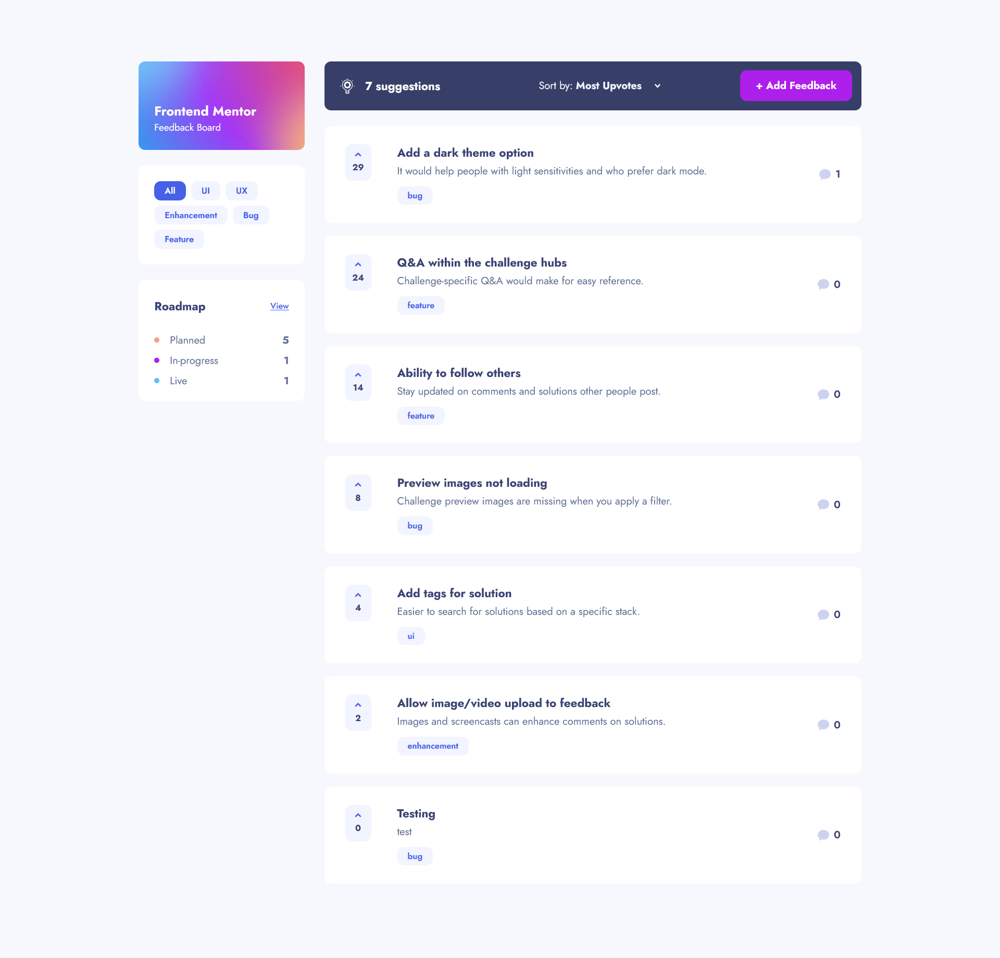

# Frontend Mentor - Product feedback app solution

This is a solution to the [Product feedback app challenge on Frontend Mentor](https://www.frontendmentor.io/challenges/product-feedback-app-wbvUYqjR6)

## Table of contents

- [Overview](#overview)
  - [The challenge](#the-challenge)
  - [Screenshot](#screenshot)
  - [Links](#links)
- [My process](#my-process)
  - [Built with](#built-with)
  - [What I learned](#what-i-learned)
  - [Continued development](#continued-development)
  - [Useful resources](#useful-resources)
- [Author](#author)
- [Acknowledgments](#acknowledgments)

## Overview

The application provides a structured way to filter, sort, gather, edit and display feedback.

### The challenge

Users should be able to:

- View the optimal layout for the app depending on their device's screen size
- See hover states for all interactive elements on the page
- Create, read, update, and delete product feedback requests
- Receive form validations when trying to create/edit feedback requests
- Sort suggestions by most/least upvotes and most/least comments
- Filter suggestions by category
- Add comments and replies to a product feedback request
- Upvote product feedback requests
- Keep track of any changes

### Screenshot

### Links

- Live Site URL: [feedback-dashboard.netlify.app](https://feedback-dashboard.netlify.app/)

## My process

### Built with

- [React](https://reactjs.org/)
- [Firebase](https://firebase.google.com/) - for data storage and CRUD functionality
- [TypeScript](https://www.typescriptlang.org/) - for type safety, improving code quality and maintainability
- [React Router](https://reactrouter.com/en/main) - for handling navigation and routing within the application.
- [React Loading](https://www.npmjs.com/package/react-loading) - to improve the user experience by visually indicating that the application is in the process of fetching data
- [Framer Motion](https://www.framer.com/motion/) - for a more dynamic user interface by creating smooth transitions¨
- [react-swipeable](https://www.npmjs.com/package/react-swipeable) - simply define swipe handlers using useSwipeable hook
- [Vite](https://vitejs.dev/) - for the build
- Git and GitHub - for version control
- custom CSS and PostCSS - to convert px values to rem for better accesibility

### What I learned

- **General Skills**

    - React:
        - Functional Components: Practiced building the application using functional components, which promote cleaner and more maintainable code.
        - State Management: Gained experience in managing state within components using hooks like useState and useEffect.
        - Props and Data Flow: Enhanced understanding of how to pass data between components using props, ensuring effective communication between   different parts of the application.
        - Handling asynchronous operations and implementing loading states.
    - TypeScript:
        - Static Typing: Learned to leverage TypeScript for static typing, which helps catch errors at compile time and improves code reliability.
        - Interfaces and Types: Defined and utilized interfaces and types to describe data structures and function signatures, enhancing code clarity and maintenance.

- **Specific Skills**

    - Firebase Integration:
        Realtime Database: Integrated the application with Firebase to enable real-time data fetching and synchronization, ensuring the UI stays up-to-date with the latest data.
    - Filtering and Sorting Logic:
        Data Manipulation: Implemented logic to filter and sort feedback items based on various criteria, improving the usability and functionality of the application.
        useMemo Hook: Learned to use the useMemo hook to memoize expensive calculations and avoid unnecessary recalculations, optimizing performance even though it might not be critical for an app of this size.
    - localStorage:
        In spite of my aim on frontend there is no user authentification logic, therefore I chose to use localStorage. Its just for learning purposes, because its easy for users to bypass it.

### Continued development

Next time, I would use these tools:
- [Tanstack Query](https://tanstack.com/) for routing, asynchronous state management and more
- [class-names](https://github.com/JedWatson/classnames) for conditionally joining classNames together
- [React Hook Form](https://react-hook-form.com/) performant, flexible and extensible forms with easy-to-use validation

### Useful resources

- [Example resource 1](https://www.example.com) - This helped me for XYZ reason. I really liked this pattern and will use it going forward.
- [Example resource 2](https://www.example.com) - This is an amazing article which helped me finally understand XYZ. I'd recommend it to anyone still learning this concept.

## Author

- Website - [Hana Maruškevičová](hanamarus.cz)
